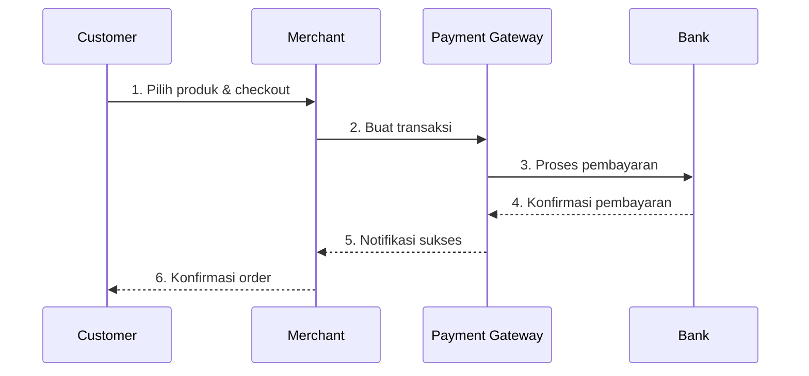
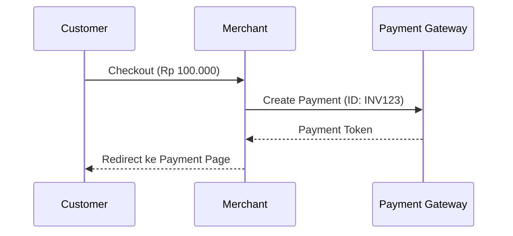

# Payment Flow: Panduan Lengkap

## Daftar Isi
1. [Pendahuluan](#pendahuluan)
2. [Pengenalan Payment Gateway](#pengenalan-payment-gateway)
3. [Konsep Dasar Payment Flow](#konsep-dasar-payment-flow)
4. [Alur Pembayaran](#alur-pembayaran)
5. [Status Pembayaran](#status-pembayaran)
6. [Integrasi Payment Gateway](#integrasi-payment-gateway)
7. [Handling Webhook](#handling-webhook)
8. [Error Handling](#error-handling)
9. [Best Practices](#best-practices)

## Pendahuluan

Payment Flow adalah alur proses pembayaran dalam sistem e-commerce atau aplikasi yang memerlukan transaksi keuangan. Memahami payment flow sangat penting untuk mengimplementasikan sistem pembayaran yang aman dan reliable.

## Pengenalan Payment Gateway

### Apa itu Payment Gateway?
Payment Gateway adalah layanan yang memproses transaksi pembayaran antara customer dan merchant. Bayangkan payment gateway seperti kasir di bank:

- **Kasir Bank** = Payment Gateway
  - Menerima uang dari nasabah
  - Memverifikasi keaslian uang
  - Memproses transaksi
  - Memberikan bukti transaksi

### Kenapa Kita Butuh Payment Gateway?

1. **Keamanan Transaksi**
   - Enkripsi data sensitif
   - Pencegahan fraud
   - Compliance dengan standar keamanan (PCI DSS)
   - Proteksi data customer

2. **Kemudahan Integrasi**
   - Tidak perlu membuat sistem pembayaran sendiri
   - Dukungan berbagai metode pembayaran
   - Dokumentasi dan SDK tersedia
   - Technical support dari provider

3. **Fitur Bisnis**
   - Dashboard monitoring
   - Laporan transaksi
   - Reconciliation tools
   - Analytic dan reporting

4. **Reliability**
   - High availability
   - Disaster recovery
   - Auto scaling
   - 24/7 monitoring

### Bagaimana Flow Pembayaran Bekerja?

#### 1. Flow Dasar (Seperti di Toko)
```plaintext
Tanpa Payment Gateway:
Customer -> Kasir -> Cash Register -> Safe -> Bank

Dengan Payment Gateway:
Customer -> Payment Gateway -> Bank -> Merchant Account
```

#### 2. Flow Detail


#### 3. Metode Pembayaran yang Didukung

1. **Bank Transfer**
   - Virtual Account
   - Direct Transfer

2. **E-Wallet**
   - GoPay
   - OVO
   - DANA
   - LinkAja

3. **Kartu**
   - Credit Card
   - Debit Card

4. **Modern Payment**
   - QRIS
   - NFC Payment
   - Link Payment

### Keuntungan Menggunakan Payment Gateway

1. **Untuk Merchant**
   - Proses pembayaran otomatis
   - Rekonsiliasi mudah
   - Mengurangi human error
   - Meningkatkan conversion rate

2. **Untuk Customer**
   - Pembayaran lebih mudah
   - Banyak pilihan metode pembayaran
   - Transaksi lebih aman
   - Proses lebih cepat

3. **Untuk Pengembangan**
   - Implementasi lebih cepat
   - Maintenance lebih mudah
   - Scaling lebih flexible
   - Update otomatis dari provider

### Pertimbangan Memilih Payment Gateway

1. **Biaya**
   - Setup fee
   - Transaction fee
   - Monthly fee
   - Settlement fee

2. **Fitur Teknis**
   - API documentation
   - SDK support
   - Webhook reliability
   - Sandbox environment

3. **Support**
   - Technical support
   - Integration support
   - Business support
   - SLA (Service Level Agreement)

4. **Keamanan**
   - Sertifikasi
   - Encryption
   - Fraud detection
   - Data protection

## Konsep Dasar Payment Flow

### Komponen Utama
Bayangkan seperti proses jual beli di toko:

1. **Merchant (Penjual)**
   - Toko/bisnis yang menjual produk/jasa
   - Memiliki merchant account di payment gateway
   - Menerima pembayaran

2. **Customer (Pembeli)**
   - Pengguna yang melakukan pembayaran
   - Memilih metode pembayaran
   - Melakukan pembayaran

3. **Payment Gateway**
   - Jembatan antara merchant dan bank
   - Memproses pembayaran
   - Menjamin keamanan transaksi

4. **Bank/Payment Provider**
   - Institusi yang memproses actual transfer
   - Memvalidasi pembayaran
   - Mengirim konfirmasi

## Alur Pembayaran

### 1. Inisiasi Pembayaran


### 2. Proses Pembayaran
Contoh flow Virtual Account:
```plaintext
1. Customer memilih pembayaran VA
2. System generate nomor VA
3. Customer transfer ke nomor VA
4. Bank detect pembayaran
5. Payment Gateway terima notifikasi
6. Merchant terima webhook
7. Order status diupdate
```

### 3. Flow Status Pembayaran
```plaintext
[CREATED] -> [PENDING] -> [PAID] -> [COMPLETED]
                      -> [EXPIRED]
                      -> [FAILED]
```

## Status Pembayaran

### 1. Status Dasar
- **CREATED**: Payment baru dibuat
- **PENDING**: Menunggu pembayaran
- **PAID**: Pembayaran diterima
- **COMPLETED**: Transaksi selesai
- **EXPIRED**: Waktu pembayaran habis
- **FAILED**: Pembayaran gagal

### 2. Contoh Implementasi
```javascript
// Model Payment Status
const PaymentStatus = {
    CREATED: 'created',
    PENDING: 'pending',
    PAID: 'paid',
    COMPLETED: 'completed',
    EXPIRED: 'expired',
    FAILED: 'failed'
};

// Handling Status Update
function handlePaymentStatus(status, orderId) {
    switch (status) {
        case PaymentStatus.PAID:
            // Update order status
            // Trigger fulfillment
            // Send notification
            break;
        case PaymentStatus.EXPIRED:
            // Cancel order
            // Return stock
            // Notify customer
            break;
        // ... handle other statuses
    }
}
```

## Integrasi Payment Gateway

### 1. Konfigurasi Awal
```javascript
// Inisialisasi Payment Gateway
const paymentGateway = new MayarClient({
    apiKey: process.env.MAYAR_API_KEY,
    apiSecret: process.env.MAYAR_API_SECRET,
    environment: 'sandbox' // atau 'production'
});
```

### 2. Create Payment
```javascript
// Membuat Payment
async function createPayment(order) {
    try {
        const payment = await paymentGateway.createPayment({
            amount: order.total,
            orderId: order.id,
            customer: {
                name: order.customerName,
                email: order.customerEmail
            },
            paymentMethods: ['va', 'ewallet', 'qris'],
            callbackUrl: 'https://your-domain.com/webhook',
            expiryPeriod: 24 * 60 // 24 jam dalam menit
        });

        return payment;
    } catch (error) {
        console.error('Payment creation failed:', error);
        throw error;
    }
}
```

### 3. Handle Payment Response
```javascript
// Response dari Payment Gateway
{
    "payment_id": "PAY123",
    "status": "pending",
    "amount": 100000,
    "payment_url": "https://pay.gateway.com/PAY123",
    "expiry_time": "2024-03-06T12:00:00Z",
    "payment_methods": [
        {
            "type": "va",
            "bank": "bca",
            "va_number": "12345678"
        }
    ]
}
```

## Handling Webhook

### 1. Setup Webhook Endpoint
```javascript
// pages/api/webhook/payment.js
export default async function handler(req, res) {
    if (req.method !== 'POST') {
        return res.status(405).json({ error: 'Method not allowed' });
    }

    // Verify webhook signature
    const signature = req.headers['x-mayar-signature'];
    if (!isValidSignature(signature, req.body)) {
        return res.status(401).json({ error: 'Invalid signature' });
    }

    const { 
        payment_id, 
        status, 
        order_id, 
        paid_amount 
    } = req.body;

    try {
        // Update order status
        await updateOrderStatus(order_id, status);
        
        // Handle based on status
        if (status === 'paid') {
            await processSuccessfulPayment(order_id);
        }

        return res.status(200).json({ message: 'Webhook processed' });
    } catch (error) {
        console.error('Webhook processing failed:', error);
        return res.status(500).json({ error: 'Webhook processing failed' });
    }
}
```

### 2. Verify Webhook
```javascript
function isValidSignature(signature, payload) {
    const expectedSignature = crypto
        .createHmac('sha256', process.env.WEBHOOK_SECRET)
        .update(JSON.stringify(payload))
        .digest('hex');

    return signature === expectedSignature;
}
```

## Error Handling

### 1. Common Errors
```javascript
try {
    const payment = await createPayment(order);
} catch (error) {
    switch (error.code) {
        case 'INVALID_AMOUNT':
            // Handle invalid amount
            break;
        case 'DUPLICATE_ORDER_ID':
            // Handle duplicate order
            break;
        case 'PAYMENT_METHOD_NOT_AVAILABLE':
            // Handle unavailable payment method
            break;
        default:
            // Handle unknown error
            console.error('Payment error:', error);
    }
}
```

### 2. Timeout Handling
```javascript
async function checkPaymentStatus(paymentId, maxRetries = 3) {
    let retries = 0;
    
    while (retries < maxRetries) {
        try {
            const status = await paymentGateway.getStatus(paymentId);
            return status;
        } catch (error) {
            retries++;
            if (retries === maxRetries) throw error;
            await new Promise(r => setTimeout(r, 1000 * retries));
        }
    }
}
```

## Best Practices

### 1. Security
- Selalu validasi webhook signature
- Gunakan HTTPS
- Simpan credentials di environment variables
- Implement rate limiting

### 2. Reliability
- Implement retry mechanism
- Log semua events
- Monitor payment status
- Setup alerts untuk failures

### 3. User Experience
- Tampilkan clear payment instructions
- Berikan estimasi waktu proses
- Notifikasi status pembayaran
- Sediakan payment proof/receipt

### 4. Data Handling
- Encrypt sensitive data
- Implement proper logging
- Regular backup
- Data retention policy

## Integrasi Mayar dengan Next.js

### Persiapan Mayar

1. **Registrasi & Credentials**
   - Daftar di [Mayar Dashboard](https://dashboard.mayar.id)
   - Dapatkan API Key dan Secret Key
   - Pilih environment (Sandbox/Production)

2. **Environment Variables**
```env
# .env.local
MAYAR_API_KEY=your_api_key
MAYAR_SECRET_KEY=your_secret_key
MAYAR_WEBHOOK_SECRET=your_webhook_secret
MAYAR_ENVIRONMENT=sandbox
```

### Setup di Next.js

1. **Install Package**
```bash
npm install @mayar/node
```

2. **Inisialisasi Client**
```typescript
// lib/mayar.ts
import { Mayar } from '@mayar/node';

const mayarClient = new Mayar({
    apiKey: process.env.MAYAR_API_KEY!,
    secretKey: process.env.MAYAR_SECRET_KEY!,
    environment: process.env.MAYAR_ENVIRONMENT as 'sandbox' | 'production'
});

export default mayarClient;
```

### Implementasi Payment

1. **Create Payment Page**
```typescript
// pages/checkout.tsx
import { useState } from 'react';
import mayarClient from '@/lib/mayar';

export default function Checkout() {
    const [loading, setLoading] = useState(false);

    const handleCheckout = async () => {
        try {
            setLoading(true);
            
            const payment = await mayarClient.createPayment({
                amount: 100000,
                currency: 'IDR',
                orderId: `ORD-${Date.now()}`,
                customer: {
                    name: 'John Doe',
                    email: 'john@example.com'
                },
                items: [
                    {
                        name: 'Product Name',
                        quantity: 1,
                        price: 100000
                    }
                ],
                paymentMethods: ['va', 'ewallet', 'qris'],
                successRedirectUrl: `${process.env.NEXT_PUBLIC_BASE_URL}/payment/success`,
                failureRedirectUrl: `${process.env.NEXT_PUBLIC_BASE_URL}/payment/failed`,
                callbackUrl: `${process.env.NEXT_PUBLIC_BASE_URL}/api/webhook/mayar`
            });

            // Redirect ke payment page Mayar
            window.location.href = payment.paymentUrl;
        } catch (error) {
            console.error('Payment creation failed:', error);
            alert('Gagal membuat pembayaran');
        } finally {
            setLoading(false);
        }
    };

    return (
        <div>
            <h1>Checkout</h1>
            <button 
                onClick={handleCheckout}
                disabled={loading}
            >
                {loading ? 'Processing...' : 'Bayar Sekarang'}
            </button>
        </div>
    );
}
```

2. **Webhook Handler**
```typescript
// pages/api/webhook/mayar.ts
import { NextApiRequest, NextApiResponse } from 'next';
import mayarClient from '@/lib/mayar';

export default async function handler(
    req: NextApiRequest,
    res: NextApiResponse
) {
    if (req.method !== 'POST') {
        return res.status(405).json({ message: 'Method not allowed' });
    }

    const signature = req.headers['x-mayar-signature'];

    if (!signature || Array.isArray(signature)) {
        return res.status(401).json({ message: 'Invalid signature' });
    }

    try {
        // Verifikasi webhook
        const isValid = mayarClient.verifyWebhook(
            signature,
            req.body
        );

        if (!isValid) {
            return res.status(401).json({ message: 'Invalid signature' });
        }

        const {
            event,
            data: {
                id: paymentId,
                status,
                order_id: orderId,
                paid_amount: paidAmount
            }
        } = req.body;

        // Handle berbagai event
        switch (event) {
            case 'payment.paid':
                await handlePaymentPaid(orderId, paidAmount);
                break;
            case 'payment.failed':
                await handlePaymentFailed(orderId);
                break;
            case 'payment.expired':
                await handlePaymentExpired(orderId);
                break;
        }

        return res.status(200).json({ message: 'Webhook processed' });
    } catch (error) {
        console.error('Webhook processing failed:', error);
        return res.status(500).json({ message: 'Internal server error' });
    }
}

async function handlePaymentPaid(orderId: string, amount: number) {
    // Update status order di database
    await db.orders.update({
        where: { id: orderId },
        data: {
            status: 'PAID',
            paidAmount: amount,
            paidAt: new Date()
        }
    });

    // Kirim email konfirmasi
    await sendPaymentConfirmationEmail(orderId);
}

async function handlePaymentFailed(orderId: string) {
    await db.orders.update({
        where: { id: orderId },
        data: { status: 'FAILED' }
    });
}

async function handlePaymentExpired(orderId: string) {
    await db.orders.update({
        where: { id: orderId },
        data: { status: 'EXPIRED' }
    });
}
```

3. **Success/Failure Pages**
```typescript
// pages/payment/success.tsx
export default function PaymentSuccess() {
    return (
        <div>
            <h1>Pembayaran Berhasil!</h1>
            <p>Terima kasih atas pembayaran Anda.</p>
            <Link href="/orders">
                Lihat Status Pesanan
            </Link>
        </div>
    );
}

// pages/payment/failed.tsx
export default function PaymentFailed() {
    return (
        <div>
            <h1>Pembayaran Gagal</h1>
            <p>Mohon maaf, pembayaran Anda gagal diproses.</p>
            <Link href="/checkout">
                Coba Lagi
            </Link>
        </div>
    );
}
```

### Fitur Khusus Mayar

1. **Custom Payment Page**
```typescript
const payment = await mayarClient.createPayment({
    // ... payment details
    appearance: {
        theme: 'light',
        colors: {
            primary: '#007bff',
            background: '#ffffff'
        },
        logo: 'https://your-domain.com/logo.png'
    }
});
```

2. **Payment Methods Specific**
```typescript
// Virtual Account
const vaPayment = await mayarClient.createPayment({
    // ... payment details
    paymentMethods: ['va'],
    vaOptions: {
        banks: ['bca', 'bni', 'mandiri'],
        suggestedAmount: [100000, 200000, 500000]
    }
});

// QRIS
const qrisPayment = await mayarClient.createPayment({
    // ... payment details
    paymentMethods: ['qris'],
    qrisOptions: {
        expiryDuration: 300 // 5 menit dalam detik
    }
});
```

3. **Recurring Payment**
```typescript
const subscription = await mayarClient.createSubscription({
    customerId: 'CUST123',
    planId: 'PLAN123',
    interval: 'month',
    intervalCount: 1,
    startDate: new Date(),
    metadata: {
        packageName: 'Premium Plan'
    }
});
```

### Best Practices Mayar

1. **Error Handling**
```typescript
try {
    const payment = await mayarClient.createPayment(paymentData);
} catch (error) {
    if (error.code === 'INVALID_AMOUNT') {
        // Handle invalid amount
    } else if (error.code === 'PAYMENT_METHOD_NOT_AVAILABLE') {
        // Handle unavailable payment method
    } else {
        // Handle unknown error
        console.error('Mayar error:', error);
    }
}
```

2. **Logging**
```typescript
// Implement logging untuk tracking
const logger = {
    payment: async (paymentId: string, action: string, data: any) => {
        await db.paymentLogs.create({
            data: {
                paymentId,
                action,
                data: JSON.stringify(data),
                timestamp: new Date()
            }
        });
    }
};

// Gunakan saat create payment
await logger.payment(paymentId, 'CREATE', paymentData);
```

3. **Monitoring**
```typescript
// Health check endpoint
export async function checkMayarStatus() {
    try {
        await mayarClient.ping();
        return true;
    } catch (error) {
        console.error('Mayar health check failed:', error);
        // Notify admin/DevOps
        return false;
    }
}
```

---

Dengan implementasi di atas, Anda telah memiliki sistem pembayaran yang terintegrasi dengan Mayar di aplikasi Next.js Anda. Pastikan untuk selalu merujuk ke [dokumentasi resmi Mayar](https://docs.mayar.id) untuk informasi terbaru dan fitur-fitur tambahan.


Cara Praktis Membuat Routes Webhook:
 